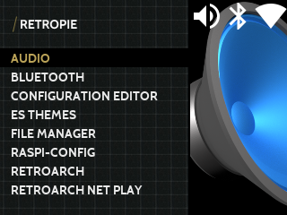
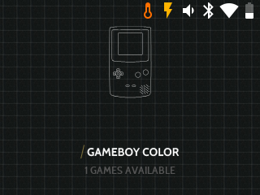
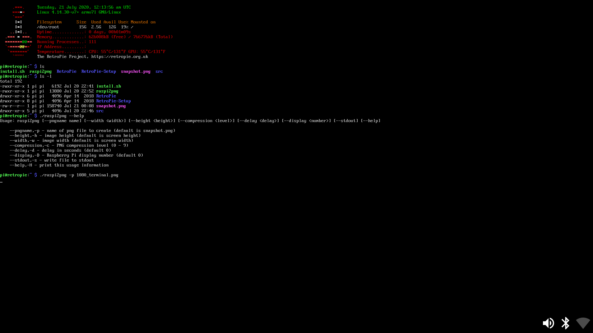
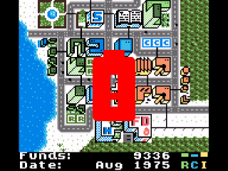

# RetroPie Status Overlay
Based on [gbz_overlay](https://github.com/d-rez/gbz_overlay) script by [d-rez](https://github.com/d-rez)
Furher based on [retropie_status_overlay] https://github.com/bverc/retropie_status_overlay script by (https://github.com/bverc/)

This repository contains a script to display lovely slightly-transparent overlays on top of your RetroPie games and emulationstation menus

## Features
- display battery level (Requires appropiate Hardware)
- display WiFi state (connected/disconnected/disabled)
- display Bluetooth state (connected/disconnected/disabled)
- display under-voltage state
- display warning if frequency-capped
- display warning if throttling
- gracefully shut down the Pi after 60s from when voltage goes below 3.2V of low voltage detected (abort shutdown when power is restored)
- show a big imminent shutdown warning when the counter starts ticking
- Only critical icons displayed in game
- Shutdown from button press

## More Screenshots

  
*Overlay on TFT theme at 240p*

  
*Overlay on Carbon theme at 1080p*

  
*Overlay on terminal*

  
*Battery Critical icon*

# Automatic Install Instructions

SSH into your device, or access the terminal using F4.
	
## Run RetroPie Status Overlay

    `cd ~`
    `git clone https://github.com/louisvarley/retropie_status_overlay`
    `cd retropie_status_overlay`
	`sudo bash install.sh`

## Follow the onscreen instructions

	retropie_status_overlay will run as a service automatically at boot, and is called "overlay"
	
	You can stop and start this service by running 
	`sudo service overlay stop`
	or
	`sudo service overlay start`	

## Battery Detection

	During setup you can choose if you are using a ADS1 or a MCP based chip. 
	MCP requires SPI pins and you set these during setup. 
	
## Calibration

	Depending on many factors, atleast from my experience with MCP based chips. The ADC (the number that the MCP chip returns from the given voltage) 
	can vary. This depends on the VREF voltage, if you are reading in the voltage from a voltage booster or from the battery. etc
	You can use the config setting "Multiplier" to calibrate this. 
	
	To do this. Run Overlay manually using the command
	`sudo python3 overlay.py`
	
	ensure you stop your current overlay service first
	
	Now using a multimeter check your battery voltage (or wherever your chip is reading from)
	Increase the multiplier until the number shown on screen once per seconds, matches that of your multimeter. 
	
	For example. My battery reads 3.56 volts. My ADC without multiplier comes in at 2.7v. I added a multiplier of 1.35 which brings me my voltage from ADC to 3.564v which is close enough. 
	Getting this correct will usually fix any problems with the device not showing as charging when a cable in inserted. 

